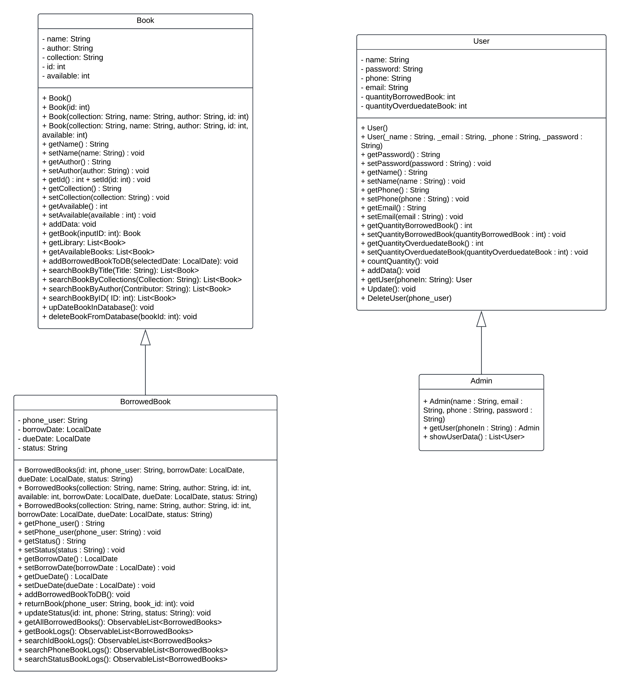

# BÀI TẬP LỚN MÔN OOP - QUẢN LÍ THƯ VIỆN

## SƠ ĐỒ LỚP

## THÀNH VIÊN VÀ NHIỆM VỤ 

### 1. Nguyễn Lê Việt Cường:
- Xây dựng sơ đồ lớp và cơ sở dữ liệu.
- Xây dựng `loginController` với các chức năng:
  - Đăng nhập
  - Quên mật khẩu
  - Tạo tài khoản mới
  - Đăng xuất
- Xây dựng `userManagement` với các chức năng:
  - Quản lý người dùng: xem thông tin người dùng, tìm kiếm người dùng, xóa người dùng.
  - Quản lý các lượt mượn sách: mượn, tìm kiếm lượt mượn, trả tài liệu, tình trạng sách.

### 2. Nguyễn Thành Đạt:
- Xây dựng `AvailableBook` với các chức năng:
  - Hiển thị sách khả dụng trong thư viện
  - Mượn sách và tìm kiếm sách
- Xây dựng `ReportController` với chức năng chính: Thống kê hiệu suất thư viện.
- Xây dựng `HomeController`: Đề xuất gợi ý tài liệu.
- Xây dựng `BorrowedBooksController`: Lưu những yêu cầu mượn sách của người dùng.
- Xử lý Đa luồng + JUnit.

### 3. Nguyễn Thời Trí:
- Xây dựng giao diện, đồ họa cho ứng dụng.
- Xây dựng `BookDetailsController`:
  - Giúp người dùng biết thêm thông tin về các quyển sách khi nhấn vào.
  - Mượn sách qua cửa sổ này.
- Xây dựng `BookManagementController`: Thêm, xóa, chỉnh sửa sách.
- Xây dựng `Settings`: Chỉnh sửa thông tin người dùng.
- Xây dựng `HelpSupportController`: Hỗ trợ giải đáp.
- Xây dựng API tra cứu thông tin tài liệu.
